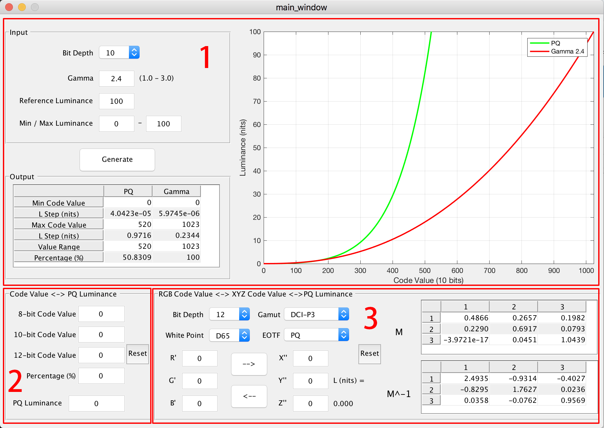

# EOTF-calculator
A MATLAB GUI for drawing and comparing EOTF plots of different specifications, converting between RGB code values and PQ luminance, and converting between XYZ values and RGB values under specified color gamut, white point and bit depth settings.

## Installation
Git clone or download the source files, and open the folder in MATLAB. Run [main_window.m](main_window.m) to start the GUI.

## Usage

As shown in the screenshot above, the GUI has three functional parts. Their main usages are as follows:

1. A plot of the gamma and PQ (SMPTE ST. 2084) EOTF curves are generated according to the specified bit depth (8/10/12), gamma value (1.0-3.0), reference luminance, and luminance interval endpoints. The output panel shows the code values of the luminance endpoints (calculated using reverse OETFs), the luminance steps near both the endpoints, and the length of the code value interval along with its proportion to the whole value range.

2. A real-time conversion between code values of different bit depths and their corresponding PQ luminance.

3. A conversion between RGB code values, XYZ code values, and PQ luminance. According to the specified color gamut and white point, the transformation matrix and its inversion are calculated and shown in the right tables.

## Author
Lu Menghe <lumenghe1994@gmail.com>
Copyright ? 2019, Beijing Film Academy

## License
This project is licensed under the MIT License - see the [LICENSE](LICENSE) file for further details.